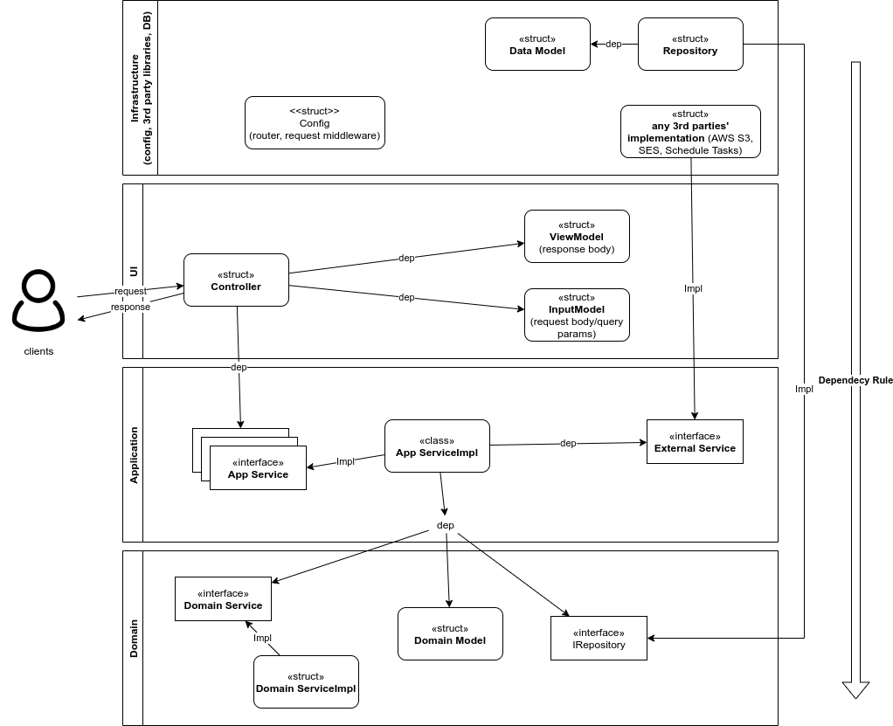
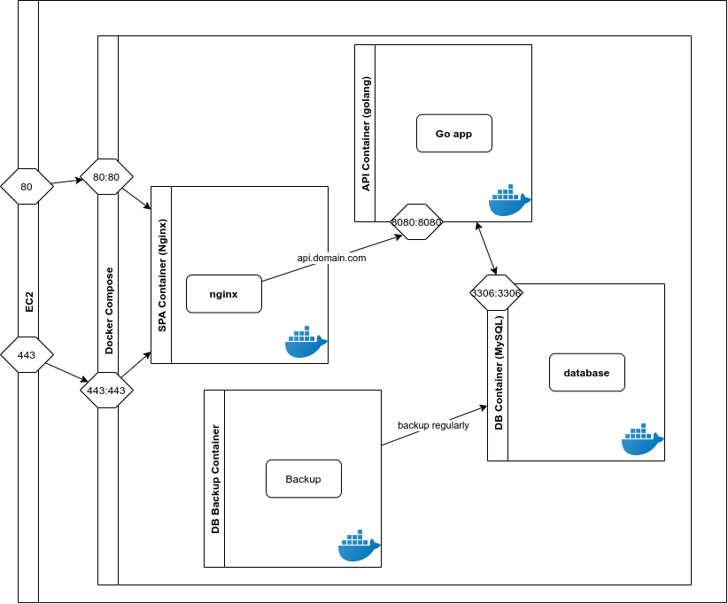
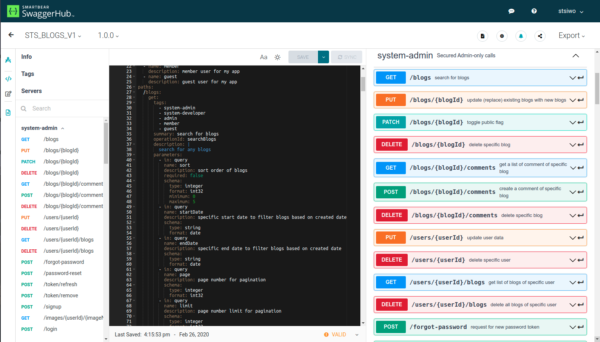

# CMS Project Overview

## Description 

A content management system to manage your blogs easily. The system is built with Go as the backend and React.js as the frontend. 

## Features

- __Blog Management__: the admin can create/update/delete its own blogs.
- __Category Management__: the admin can create/update/delete its own categories.
- __Account Management__: the admin can update its own account information (e.g., name, email, password, profile image, and so on)
- __Auto Save Features__: when the admin is writing a blog, every time he edit the blog, it automatically save the change without clicking 'save' button.
- __Rich Text Editor__: the admin does not need to write any code when writing a blog. this has the following main features:
  * change text style, size, and font.
  * insert any image and video. The image is automatically uploaded to S3 bucket. 
  * insert advertisement code (e.g., AdSense code) inside a blog content.
  * insert bubble comments/conversations to make the content easier to understand.   

## Main Dependencies

### Backend 

- [__Go Module__](https://go.dev/blog/using-go-modules): the main package management system. 

- [__wire__](https://github.com/google/wire): (v0.4.0) the dependency management system.

- [__gin__](https://github.com/gin-gonic/gin): (v1.6.3) a web framework for Go.

- [__gocron__](https://github.com/go-co-op/gocron): (v0.5.0) a scheduled task manager.

- [__gorm__](https://github.com/go-gorm/gorm): (v1.9.12) an ORM.

- [__godotenv__](https://github.com/joho/godotenv): (v1.3.0) to read env files. 

- [__gin-jwt__](https://github.com/dgrijalva/jwt-go): (v2.6.4) an extension libary to handle jwt with the gin framework. 

- [__cors__](https://github.com/rs/cors): (v1.7.0) to allow to communicate SPA and API esp different origins.

- [__aws-sdk-go__](https://github.com/aws/aws-sdk-go): (v1.31.0) to communicate with AWS services
 
- [__testify__](https://github.com/stretchr/testify): (v1.5.1) unit/integration testing library

### Frontend

- [__React__](https://reactjs.org/): (v16.8.6) the main library for dom creation.

- [__ReactQuill__](https://quilljs.com/): (v1.3.5) a rich text editor library to allow my users to create blog content without writing code.

- [__Redux__](https://redux.js.org/): (v7.2.1) a state management system for React.js

- [__TypeScript__](https://www.typescriptlang.org/): (v3.9.5) a type system for JS.

- [__Webpack__](https://webpack.js.org/): (v4.32.2) a module bundler. 

- [__Jest__](https://jestjs.io/): (v3.9.5) the main testing library for js.


## Backend Arcitecture

I usually apply [Clean Architecture](http://blog.cleancoder.com/uncle-bob/2012/08/13/the-clean-architecture.html) for any project including my Go projects.
The main reason why use this architecture is to achieve [the separation of concerns](https://deviq.com/principles/separation-of-concerns). The general idea is that we should separate different concerns (e.g., Domain, UI, Application and so on) into its corresponding layer to establish well-organized systems. It has the following benefits:

- __testability__: easy to test each component/concern
- __independence__: easy to replace a component with a new one including external/internal dependencies (e.g., DB, Web Framework, any external API)
- __decouping__: reduce regression errors if one of the component/concern need to be changed. 

There is important rule to accomplish the above benefits, which is called the Depednency Rule. The rule is pretty simple. The components (e.g., classes/structs) in the higher layer can use or have dependencies of interfaces in the lower layer, not vice versa. For instance, a component in the Infrastructure layer can have dependencies of components in the Application layer, but components in the Domain layer cannot have dependencies of the Application layer. 



I think that this rule strongly contributes to the independence of components/layers. For example, your team decided to use RDBMS such as MySQL for your project initially. After while you release the project, you need to scale up the system for some reason. Then, you team decided to use NoSQL to take an advantage of the scalability. If you apply the Clean Architecture, you can easily replace RDBMS with NoSQL.     

## Infra Architecture

I mainly used AWS and Docker to design and implement the infrastructure. 



### AWS

- __EC2__: a vertial machine. I used two EC2 instances for both the frontend SPA and the backend API. 

- __S3__: used for storing images (e.g., blog/profile), log files, and backup files. I integrated my API with S3 so that my API can send requests for uploading, updating, deleting objects in S3 programmatically.

- __SES__: used for sending email to the owner when a contact form was submitted.

- __SNS__ and __Lambda__: used for handling received email from users. When SES received an email, SNS issues a notification and a subscribed lambda function is executed. The lambda function forwards the received email to the owner's private email address.

- __CloudWatch__: used for handling scheduled tasks with cron. For example, I used it for renewing SSL certificates of my SPA and API. 

- __Route53__: route incoming requests to my ec2 instances. 

## Implementations

### AWS API Integration (Go)

I integrated with S3 to store images sent from clients such as blog and profile images. the below code is an example to upload an image from my Go app to S3.

```
// s3.go 
ackage aws

import (
	"log"
	"mime/multipart"

	"github.com/aws/aws-sdk-go/aws"
	"github.com/aws/aws-sdk-go/aws/awserr"
	"github.com/aws/aws-sdk-go/service/s3"
	"github.com/aws/aws-sdk-go/service/s3/s3manager"
	er "github.com/stsiwo/cms/err"
	"github.com/stsiwo/cms/external"
)

// define struct for S3
type S3 struct {
	client   external.IS3Client
	uploader external.IS3Uploader
  cacheControlValue string
}

// create a provider so that this depenency is automatically injected into the client struct
// * I use the wire package for dependency management system.
func NewS3(client external.IS3Client, uploader external.IS3Uploader) *S3 {
	return &S3{
		client:   client,
		uploader: uploader,
    cacheControlValue: "max-age=31536000",
	}
}

// use versioning of s3
//  - without any file extension to be consistent with its name when uploading so can put in the same object
//  - when user upload a file (xxx.png), change its name to uuid and use this uuid as object name for this avatarImage
//  - when user update the file (yyy.jpg), first retrieve the user's file name from db 
//    and just update its body (file itself) but keep its name for preserving previous version in the case of failure


// create a method called 'Upload' to upload an image to S3
func (e *S3) Upload(file multipart.File, newFileName string, bucketName string) (string, string, error) {
	log.Println("start handling upload function at s3 (infra)")

	// prep Upload Input
	upParams := &s3manager.UploadInput{
		Bucket: &bucketName,
		Key:    &newFileName,
		Body:   file,
    	CacheControl: &e.cacheControlValue,
	}

	// upload to s3
	result, err := e.uploader.Upload(upParams, func(u *s3manager.Uploader) {
		u.PartSize = 10 * 1024 * 1024 // 10MB part size.
	})
 
 // if failed, return error message.
	if err != nil {
		log.Printf("err during requesting upload to aws s3: %#v", err.Error())
		return "", "", &er.ApiErr{Err: nil, Message: "error during uploading image to s3 service", Code: 500}
	}
 
	// if succeeded, return its url and version id of the s3 object.
	log.Printf("uploading success and the version id is: %#v", *result.VersionID)
	log.Printf("uploading success and the location is: %#v", result.Location)
	return result.Location, *result.VersionID, nil
}

// omit other methods for brivety.
```

### RESTful API (Go)

I usually use Swagger to design RESTful API and implement it based on the design. The basic steps that I use to design the API is the following (assuming that I identified the client requirement):

1. identify the resources
2. identify the HTTP methods 
  - GET: to get a resource or collection of resources.
  - POST: to create a resource or collection of resources.
  - PUT: to replace the existing resource or collection of resources.
  - PATCH: to partially update the existing resource or collection of resources.
  - DELETE: to delete the existing resource or the collection of resources.
3. identify query paramters (e.g., limit, offset, sort, and so on)
4. identify HTTP response status code (e.g., 200, 201, 400, 500, and so on)
5. identify the protected resources with user roles. (e.g., which user role can access which endpoint)
6. identify HATEOAS (e.g., links to the next possible endpoints)



### Common Flow (Go)

Here is a common flow how a request is handled at this endpoint. In this example code, it demonstrates how to handle a GET reqeust to return a blog collection. 

1. accept a request at the router.

```
// endpoints.go (router)

// blogs
type BlogEndpoint struct {
}

func (e *BlogEndpoint) Config(router *gin.Engine, jwt *jwt.GinJWTMiddleware, mocksParams *mocks.MockParams) {

	// blogs endpoints
	blogEndpoint := router.Group("blogs")
	{
		blogController := di.InitializeBlogController(mocksParams)

		// public blog list request (public must be true)
		blogEndpoint.GET("", blogController.Get)
		...
	}
	...
}
```

2. the router delegates the request to a controller.

```
// blog.go (controller)
package controller

import (
	_ "encoding/json"
	"github.com/gin-gonic/gin"
	db "github.com/stsiwo/cms/domain/blog"
	e "github.com/stsiwo/cms/err"
	"github.com/stsiwo/cms/ui/iservice"
	"github.com/stsiwo/cms/ui/model/view"
	"github.com/stsiwo/cms/util"
	"log"
	"net/http"
)

// define controller struct for blog
type BlogController struct {
	service iservice.IBlogService
}

// create a provider so that this depenency is automatically injected into the client struct
// * I use the wire package for dependency management system.
func NewBlogController(service iservice.IBlogService) *BlogController {
	return &BlogController{
		service: service,
	}
}

// create a method to handle GET requests and return a blog collection (publicity must be true)
func (uc *BlogController) Get(c *gin.Context) {
	var blogQueryString db.BlogQueryString

	// bind query string or form
	if err := c.Bind(&blogQueryString); err != nil {
		log.Printf("query string binding failed: %#v", err.Error())
	}
	
	// DON'T FORGET SET PUBLIC TO BE TRUE
	blogQueryString.SetPublic(db.PublicOnly)

	// prepare a response view model
	viewModel := view.BlogListResponseViewModel{}

	// call its service struct and delegate application logic to it.
	// if there is an error, return the error response with the status code.
	if err := uc.service.GetAll(blogQueryString, &viewModel); err != nil {
		apiErr := err.(*e.ApiErr)
		c.JSON(apiErr.Code, gin.H{
			"code":    apiErr.Code,
			"message": apiErr.Message,
		})
		return
	}

	// if succeeded, return the collection with the status code.
	c.JSON(http.StatusOK, gin.H{
		"code":    http.StatusOK,
		"message": "get blog list success (GET)",
		"data":    viewModel,
	})
}
...
```

3. the controller delegate its task to a service.

```
// blog.go (service)
package service

import (
	"log"

	"github.com/jinzhu/copier"
	"github.com/jinzhu/gorm"
	"github.com/stsiwo/cms/app/irepository"
	db "github.com/stsiwo/cms/domain/blog"
	"github.com/stsiwo/cms/infra/model"
	"github.com/stsiwo/cms/infra/pagination"
	"github.com/stsiwo/cms/ui/model/view"
	"github.com/stsiwo/cms/util"
)

// define a service struct for blog
type BlogService struct {
	repo irepository.IBlogRepository
	db   *gorm.DB
}

// create a provider so that this depenency is automatically injected into the client struct
// * I use the wire package for dependency management system.
func NewBlogService(repo irepository.IBlogRepository, db *gorm.DB) *BlogService {
	return &BlogService{
		repo: repo,
		db:   db,
	}
}

func (uc *BlogService) GetAll(qs db.BlogQueryString, vm *view.BlogListResponseViewModel) error {
	log.Printf("start handling get all service at blog service \n")

	blogList := []model.Blog{}
	viewBlogList := []view.BlogListViewModel{}

	// find blog by id	
	// need to pass a pointer to 'blogList' slice to update it inside this called function.
	if err := uc.repo.GetAll(qs, &blogList); err != nil {
		log.Printf("get a blog list failed: %#v \n", err)
		return err
	}

	// convert from data model to view model
	copier.Copy(&viewBlogList, blogList)

	// query to get count all blog for pagination
	var totalCount int
	if err := uc.repo.CountAll(qs, &totalCount); err != nil {
		log.Printf("get a blog count all failed: %#v \n", err)
		return err
	}

	// construct pagination struct
	pagination := view.Pagination{
		Page:  qs.Page,
		Limit: qs.Limit,
		// default total page button number is 5
		PageLinks:  pagination.GeneratePaginationLink(totalCount, qs.Limit, qs.Page, 5),
		TotalCount: totalCount,
		MaxPageNum: pagination.CalculateMaxPageNumber(totalCount, qs.Limit),
	}

	// fill view model with data
	vm.Blogs = viewBlogList
	vm.Pagination = pagination

	// return view model
	return nil
}
...
```

```
// blog.go (repository)
package repository

import (
	"html"
	"log"
	"strings"

	"github.com/jinzhu/gorm"
	db "github.com/stsiwo/cms/domain/blog"
	e "github.com/stsiwo/cms/err"
	"github.com/stsiwo/cms/infra/model"
	qb "github.com/stsiwo/cms/infra/query/blog"
	"github.com/stsiwo/cms/util"
)

// define a repository struct for blog
type BlogRepository struct {
	db    *gorm.DB
	query qb.IQuery
}

// create a provider so that this depenency is automatically injected into the client struct
// * I use the wire package for dependency management system.
func NewBlogRepository(db *gorm.DB, query qb.IQuery) *BlogRepository {
	return &BlogRepository{
		db:    db,
		query: query,
	}
}

...

// only public blog list
func (uc *BlogRepository) GetAll(qs db.BlogQueryString, blogs *[]model.Blog) error {
	log.Println("start handling get all a blog request at blog repository")

	// statement with scope condition; include category domain
	stm := uc.db.Preload("User").Preload("Categories")

	// apply query param to filter/sort the blog collection
	stm = uc.query.ApplyConditions(stm, qs, false)

	// Preload allow to load with related roles
	if stm.Find(blogs).RecordNotFound() {
		log.Println("the provided blog does not exist")
		return &e.ApiErr{Err: nil, Message: "the provided blogs does not exist", Code: 404}
	}

	return nil
}

...
```
5. the controller return the response. 

### Testing (Go)

use testify as testing package for my Go project. Here is my example code to test /blogs endpoints with 'sort' query param to make sure that the collection in the response properly sorted.

```
package blogs

import (
	"encoding/json"
	"io/ioutil"
	"log"
	"net/http/httptest"
	"strconv"
	"strings"
	"testing"
	"time"

	"github.com/jinzhu/gorm"
	uuid "github.com/satori/go.uuid"
	"github.com/stretchr/testify/suite"
	"github.com/stsiwo/cms/infra"
	"github.com/stsiwo/cms/infra/model"
	"github.com/stsiwo/cms/mocks"
	"github.com/stsiwo/cms/router"
	"github.com/stsiwo/cms/util"
)

// BeforeTest(suiteName, testName string) - Runs right before the test starts
// AfterTest(suiteName, testName string) - Runs right after the test finishes
// SetupSuite() - Runs before the tests in the suite
// SetupTest() - Runs before each test in the suite
// TearDownTest() - Runs after each test in the suite
// TearDownSuite() - Runs after all the tests in the suite have been run

// This is our suite
type BlogEndpointSuite struct {
	suite.Suite
	db *gorm.DB
}

// This gets run automatically by `go test` so we call `suite.Run` inside it
func TestSuite(t *testing.T) {
	// This is what actually runs our suite
	suite.Run(t, new(BlogEndpointSuite))
}

// lifecycle methods

func (suite *BlogEndpointSuite) SetupSuite() {
	// Initialize things or do any setup stuff inside here
	log.Println("setup suite")
	suite.db = infra.SetupDB()
	Seed(suite.db)
}

// This method gets run before each test in the suite
func (suite *BlogEndpointSuite) SetupTest() {
	// Initialize things or do any setup stuff inside here
	log.Println("setup test")
	// transaction start db
}

// This method gets run before each test in the suite
func (suite *BlogEndpointSuite) TearDownTest() {
	// Initialize things or do any setup stuff inside here
	log.Println("teardown test")
	// transaction rollback db
}

func (suite *BlogEndpointSuite) TearDownSuite() {
	// Initialize things or do any setup stuff inside here
	log.Println("teardown suite")
	// suite.tx.Rollback()
	CleanUpAllRecords(suite.db)
	suite.db.Close()
}

// test the /blogs endpoint with sort query param to make sure that 
// the blog collection in the response is properly sorted alphabetically (ascending order) 
func (suite *BlogEndpointSuite) TestBlogListGetEndpointShouldSortBasedOnTheSortQueryStringAlphaAsc() {
	// sort is 2 (alpha asc)

	// setup router
	setupRouter := router.NewSetupRouter()
	router := setupRouter.Setup(&mocks.MockParams{})

	// run test server
	ts := httptest.NewServer(router)
	defer ts.Close()

	// setup client
	client := ts.Client()

	// start request to test server
	res, err := client.Get(ts.URL + "/blogs?sort=2")
	if err != nil {
		log.Fatal(err)
	}

	// parsing body
	body, err := ioutil.ReadAll(res.Body)
	res.Body.Close()
	if err != nil {
		log.Fatal(err)
	}
	var bodyMap map[string]interface{}
	json.Unmarshal(body, &bodyMap)

	// asserting
	suite.Equal(res.StatusCode, 200)
	blogs := bodyMap["data"].(map[string]interface{})["blogs"]
	for i := 0; i < len(blogs.([]interface{}))-1; i++ {

		// sort check
		firstTitle := blogs.([]interface{})[i].(map[string]interface{})["title"].(string)
		nextTitle := blogs.([]interface{})[i+1].(map[string]interface{})["title"].(string)

		log.Printf("first date: %#v", firstTitle)
		log.Printf("next date: %#v", nextTitle)

		suite.True(firstTitle[0:1] <= nextTitle[0:1])
	}
}

```

### Admin Blog List Component (React & TypeScript)

This is a blog management compoent for admin user. The component is in charge of displaying all blogs and handling any delete/edit click event when the admin click one of the buttons. 

```
// blogManagement.tsx
type OptionType = {
  label: string
  value: CategoryType
}

const BlogManagement: React.FunctionComponent<{}> = (props) => {

  // router history
  const history = useHistory();

  // get cur filters from mem selector
  const curFilters = useSelector(mSelector.makeAdminBlogFiltersSelector())

  // get cur fetch status from mem selector
  const currentBlogsFetchStatus = useSelector(mSelector.makeBlogsFetchStatusSelector())

  // get cur blog list from mem selector
  const { data: curBlogList, pagination: curPagination } = useSelector(mSelector.makeAdminBlogSearchResultSelector())

  const dispatch = useDispatch()

  // dispatch action to fetch blogs only once
  React.useEffect(() => {
    dispatch(requestFetchAdminBlogsActionCreator())
  }, [
      JSON.stringify(curFilters)
    ])

  // typeahead temp state for 'keyword' (1)
  // assign curSearchKeywordState as default value since this component is shared by other components 
  // which exists on the same page, so if you put empty string as default value, the empty string is used for 
  // the action and it is dispatched. then, shows search result with the empty string keyword.
  const [curTypeAheadKeywordState, setTypeAheadKeywordState]  = React.useState<string>(curFilters.keyword)

  // use effect for type ahead (2)
  React.useEffect(() => {
    dispatch(updateAdminBlogKeywordFilterActionCreator(curTypeAheadKeywordState))
  }, [
    JSON.stringify(curTypeAheadKeywordState)
  ])

  // keyword input change event handler (3)
  const handleKeywordFilterInputEvent: React.EventHandler<React.ChangeEvent<HTMLInputElement>> = React.useCallback((e) => {
    setTypeAheadKeywordState(e.currentTarget.value) 
  }, [setTypeAheadKeywordState])

  // delete trigger
  const [curDeleteBlogTrigger, setDeleteBlogTrigger] = React.useState<boolean>(false)

  // popup for delete confirmation
  const { curPopup, setPopup } = usePopup({})

  // category selection event handler
  const handleCategorySelectionChangeEvent: (value: OptionType, actionMeta: ActionMeta) => void = React.useCallback((value, actionMeta) => {
    dispatch(blogFilterCategoryActions.update(value.value.name))
  }, [dispatch])

  // start date selection event handler
  const handleStartDateSelectionChangeEvent: (date: Date) => void = React.useCallback((date) => {
    dispatch(blogFilterStartDateActions.update(date))
  }, [dispatch])

  // start date deletion click event handler
  const handleStartDateDeleteClickEvent: () => void = React.useCallback(() => {
    dispatch(blogFilterStartDateActions.clear())
  }, [dispatch])

  // end date selection event handler
  const handleEndDateSelectionChangeEvent: (date: Date) => void = React.useCallback((date) => {
    dispatch(blogFilterEndDateActions.update(date))
  }, [dispatch])

  // end date deletion click event handler
  const handleEndDateDeleteClickEvent: () => void = React.useCallback(() => {
    dispatch(blogFilterEndDateActions.clear())
  }, [dispatch])


  // public input change event handler
  const handlePublicFilterInputEvent: React.EventHandler<React.ChangeEvent<HTMLInputElement>> = React.useCallback((e) => {
    dispatch(blogFilterPublicActions.update(e.currentTarget.value as unknown as PublicOptionEnum))
  }, [dispatch])

  // sort input change event handler
  const handleSortFilterInputEvent: React.EventHandler<React.ChangeEvent<HTMLInputElement>> = React.useCallback((e) => {
    dispatch(blogFilterSortActions.update(e.currentTarget.value as unknown as BlogSortEnum))
  }, [dispatch])

  // handle pagination btn click event
  const handlePaginationBtnClick: React.EventHandler<React.MouseEvent<HTMLButtonElement>> = React.useCallback((e) => {
    dispatch(blogFilterPageActions.update(e.currentTarget.value as unknown as number))
  }, [dispatch])

  // blog delete click event handler
  const { currentRequestStatus: currentDeleteBlogFetchStatus, setRequestStatus: setDeleteBlogFetchStatus, sendRequest: requestDeleteBlog } = useRequest({})
  const handleBlogDeleteClickEvent: React.EventHandler<React.MouseEvent<HTMLDivElement>> = (e) => {
    let targetBlogId = e.currentTarget.getAttribute("data-blog-id")

    requestDeleteBlog({
      path: '/users/' + appConfig.ownerId + "/blogs/" + targetBlogId,
      method: RequestMethodEnum.DELETE,
      useCache: false,
      allowCache: false,
    })
      // call from previous 'catch' and 'then' of 'fetchBlog'
      // since resolve promise in the 'catch'
      .then((result: ResponseResultType<any>) => {
        log("new category response result")
        log(result)
        if (result.status === ResponseResultStatusEnum.SUCCESS) {
          setDeleteBlogTrigger(!curDeleteBlogTrigger)
          dispatch(resetCacheAfterBlogUpdateActionCreator())
        }
        if (result.status === ResponseResultStatusEnum.FAILURE) {
          // show error message
          setPopup((prev: PopupStateType) => ({
            ...prev,
            title: "失敗！",
            message: result.errorMsg,
            type: PopupMessageTypeEnum.Error,
            curState: true,
          }))
        }
      })
  }

  // handle delete click event handler
  const handleTogglePopupForDeleteBlogClickEvent: React.EventHandler<React.MouseEvent<HTMLElement>> = (e) => {
    let targetBlogId = e.currentTarget.getAttribute("data-blog-id")
    setPopup((prev: PopupStateType) => ({
      ...prev,
      title: appConfig.message.popup.blogDeleteConfirmation.title,
      message: appConfig.message.popup.blogDeleteConfirmation.message,
      type: appConfig.message.popup.blogDeleteConfirmation.type,
      curState: true,
      confirmBtns: {
        onConfirm: handleBlogDeleteClickEvent
      },
      extraProps: {
        ['data-blog-id']: targetBlogId
      }
    }))
  }


  // blog edit click event handler
  const handleBlogEditClickEvent: React.EventHandler<React.MouseEvent<HTMLDivElement>> = (e) => {
    let targetBlogId = e.currentTarget.getAttribute("data-blog-id")
    history.push(`/admin/edit-blog-management/` + targetBlogId)
  }

  // move to new blog page when new blog icon is clicked
  const handleNewBlogIconClick: React.EventHandler<React.MouseEvent<HTMLDivElement>> = (e) => {
    let newBlogId = getUuidv4()
    history.push(`/admin/edit-blog-management/` + newBlogId)
  }

  // render editable blog list
  const renderEditableBlogItems: () => React.ReactNode = () => {
    return curBlogList.map((blog: BlogType) => {
      return (blog ? 
        <EditableBlog blog={blog} key={blog.id} onEdit={handleBlogEditClickEvent} onDelete={handleTogglePopupForDeleteBlogClickEvent} /> : null
      )
    })
  }

  return (
    <div className="admin-blog-management-wrapper">
      <h2 className="admin-content-title">
        {"ブログ管理"}
      </h2>
      <div className="admin-filter-wrapper">
        <h3 className="admin-filter-title">
          {"絞り込み"}
        </h3>
        <div className="admin-filter-content">
          <KeywordFilter
            curState={curTypeAheadKeywordState}
            onInputChange={handleKeywordFilterInputEvent}
            inputWrapperClassName={"admin-blog-management-filter-input-wrapper"}
          />
          <CategoryFilter
            curState={curFilters.category}
            onInputChange={handleCategorySelectionChangeEvent}
            inputWrapperClassName={"admin-blog-management-filter-input-wrapper"}
          />
          <DateFilter
            curStartDateState={curFilters.startDate}
            curEndDateState={curFilters.endDate}
            onStartDateChange={handleStartDateSelectionChangeEvent}
            onEndDateChange={handleEndDateSelectionChangeEvent}
            onStartDateDelete={handleStartDateDeleteClickEvent}
            onEndDateDelete={handleEndDateDeleteClickEvent}
            inputWrapperClassName={"admin-blog-management-filter-input-wrapper"}
          />
        </div>
        <PublicFilter
          curState={curFilters.public}
          onInputChange={handlePublicFilterInputEvent}
        />
      </div>
      <div className="admin-sort-wrapper">
        <h3 className="admin-filter-title">
          {"並び替え"}
        </h3>
        <BlogSort
          curState={curFilters.sort}
          onInputChange={handleSortFilterInputEvent}
        />
      </div>
      {(currentBlogsFetchStatus === ResponseResultStatusEnum.FETCHING && 
        <Loading />
      )}
      <div className="admin-blog-result-wrapper">
        {curBlogList && curBlogList.length > 0 && renderEditableBlogItems()}
      </div>
      <div className="admin-blog-pagination-btn-wrapper">
        {(Object.keys(curPagination).length > 0 &&  // check object is empty or not
          <Pagination
            curPage={curFilters.page}
            maxPage={curPagination.maxPage}
            pageLinks={curPagination.pageLinks}
            onClick={handlePaginationBtnClick}
          />
        )}
      </div>
      {(curPopup.curState &&
        <Popup
          curPopup={curPopup}
          setPopup={setPopup}
        />
      )}
      <div className="icon-wrapper right-btm-fixed-btn" onClick={handleNewBlogIconClick} role="go-back-site-btn">
        
      </div>
    </div>
  )
}

export default BlogManagement
```

## RDBMS (MySQL) 

design and implement RDBMS.

1. create tables with fields based on the requirment.
2. identify the relationship
  - One-To-One: put a foreign key field on "One" table, use same primary key on both tables, or embed "One" table to another so you don't need to use the relationship.
  - One-To-Many: put a foreign key field on "Many" table.
  - Many-To-Many: create a join table and put primary key of both tables into the join table as foreign keys
3. identify the cascading (e.g., how to deal with child tables when the parent is updated/deleted)
4. identify the index to boost performance. (e.g., columns that often used in 'where' or 'join' clause.)

## Security

  - __Content Security Policy__: list trusted domains and the scripts allow to be executed. Otherwise, CSP blocks executing scripts provided by untrusted domains (any domain is not listed in CSP). This mitigates XSS attacks. 
 
  - __CORS__: when a domain (let's say domain A) access to another domain (domain B) to retrieve resources, the domain B can control which domain (esp, cross domains) can access to my resource.  
 
  - __Sanitize All User Input__: To prevent XSS attack and SQL injection. in the front end and back end, don't forget to validate input and sanitize it.
 
  - __No Dynamic Query__: To prevent SQL inject. in any ORM, you always should use parameter binding (e.g., 'setParamter') and don't do like this (e.g., "SELECT x from " + input + "...")
 
  - __JWT HttpOnly & Secure Cookie and [Double Submit Cookie](https://cheatsheetseries.owasp.org/cheatsheets/Cross-Site_Request_Forgery_Prevention_Cheat_Sheet.html)__: JWT is a better approach than HTTP Basic Authentication with a password. a client sends the credential only once and exchanges it a token (a.k.a JWT) with expiry, and use it to access protected resources. Now, the problem is where to store the JWT in the front end. If you store in session or local storage in browsers, it is under the target of XSS since js can access that storage. The more secure approach is to use httpOnly & Secure Cookie (e.g., js cannot access and send over TLS only) and put the token in the cookie. However, httpOnly cookie is well known as a target of CSRF. If a malicious attacker sends a link that requests to the authorized website, it might result in unwanted results for the victim. That's why I use the Double Submit Cookie technique. You need to add a token (a.k.a CSRF token) and ask auth users to send it with a header, and the server verifies the CSRF token in header and cookie match each other. this mitigates CSRF attacks. 
 
  - __Security Headers__: Don't forget the following security headers in your web servers:
    * Strict-Transport-Security: Tell browsers that it should only be accessed using HTTPS (no HTTP). Many websites configure redirect from HTTP to HTTPS. This redirect creates a security hole such as a man-in-the-middle-attack. Therefore, setting this header prevents the security hole.
    * X-Frame-Options: Prevent the target page from being framed by another website. the difference btw frame-src (CSP) and X-Frame-Options is that frame-src restricts other resources. On the other hand, X-Frame-Options is used to restrict your page to be framed by other domains.
    * X-XSS-Protection: Used for only old browsers which don't support CSP, but you still should add this header.
    * X-Content-Type-Options: To prevent MIME sniffing (e.g., browsers try to correct the wrong extension and execute the file). This creates a security hole. for example, If malicious users upload a JS file as an image file and when other users access the website, the browser executes the js file by sniffing.

## Code Reviews

follow [the coding guideline](https://github.com/golang/go/wiki/CodeReviewComments) 

